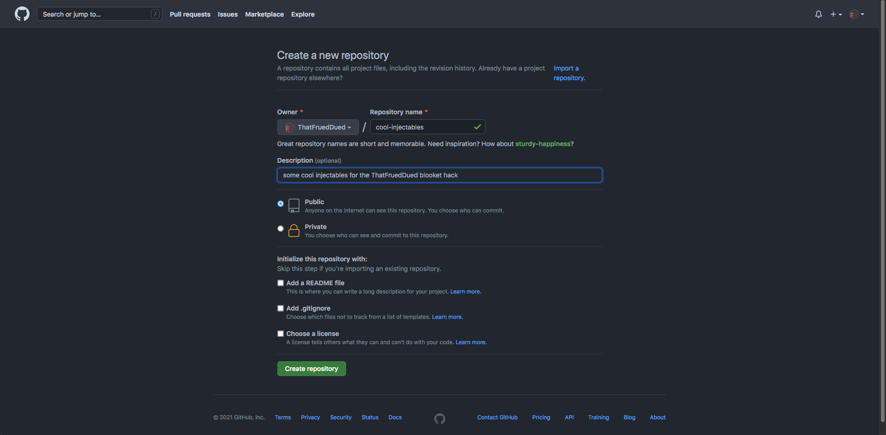
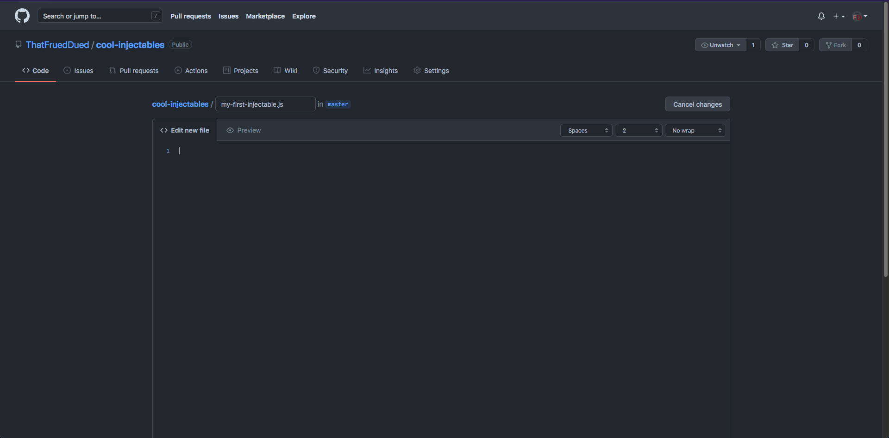
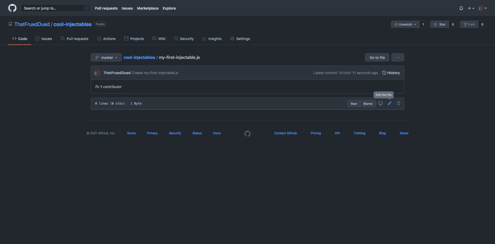

# How to Make Injectables

## Disclaimer
This guide is for developers that know JavaScript and does not teach you how to code. If you do not know how to code or how to use JavaScript, this guide will be very confusing.

## Setting Up GitHub
The easiest way to make injectables is to use GitHub Pages. If you have experience with hosting web servers and you would like to use that instead, be sure to set the "Access-Control-Allow-Origin" response header to "*" to ensure Blooket can load your script.
First, make a new GitHub repository at <https://github.com/new>.  
  

Now, let's make our script. Click on "creating a new file". Name this file "my-first-injectable.js" or whatever else you want.  
  
Then, scroll down and click the green "Commit new file" button. Next, go to the "Settings" tab and click the "Pages" tab on the left. Change "Source" from "None" to "master" or "main". Also, copy the URL where is says your site is ready to be published to; it will be required later. 
  
Now, go back to the "Code" tab at the top, click on the file you just created, and click the pencil button to edit it.  
  
Nice! Now, let's add your injectable to the ThatFruedDued Blooket Utility.

## Adding Your Injectable (GitHub)
Go to <https://www.blooket.com> and enable the ThatFruedDued Blooket Utility. Then, click "Add Injectable" at the top of the page. Paste the GitHub Pages URL, then type the name of your script. For example, my repository's URL was `https://thatfrueddued.github.io/cool-injectables/`, and my script name was `my-first-injectable.js`, so my complete injectable URL would be `https://thatfrueddued.github.io/cool-injectables/my-first-injectable.js`. Then, you can click on "Injectables" in the Blooket Utility and enable yours.

## Coding the Injectable
Injectables are always loaded after the original Blooket page has been removed and before the new Blooket page has been injected. This phase visually shows up as a brief white screen after the tab has loaded. Be sure to either not rely on the Blooket GUI or detect when the Blooket GUI launches to run code. When your code has been injected, several methods will already have been injected to assist you in development. Prefs are storage for different settings and toggles for your injectable. Note that prefs can be any `JSON.stringify`-able type, but only objects and bools will appear in the prefs menu.

### `getPref`
Gets the current value of a preference based on its path. Returns the value of the pref or `false` if it does not exist. Ex: `getPref('essentialPatches')`, `getPref('towerDefense/everythingIsFree')`

### `setPref`
Sets the value of a preference. Ex: `setPref('coolInjectables', {myPref: true})`, `setPref('coolInjectables/myPref', true)`. The first example here sets the `coolInjectables` pref to an object containing `myPref` which is set to true. The second example only sets `myPref` in the `coolInjectables` pref, not the entire `coolInjectables` pref. The second example would also throw an error if `coolInjectbles` did not exist.

### `delPref`
Deletes a preference from the pref tree entirely. Ex: `delPref('coolInjectables')`

### `setFormat`
Sets how a preference will appear in the prefs menu. Ex: `setFormat('coolInjectables/myPref', 'My Pref')`, `setFormat('coolInjectables', 'Cool Injectables')`

### `delFormat`
Removes data on how a preference will appear in the prefs menu. Ex: `delFormat('coolInjectables/myPref')`, `delFormat('coolInjectables')`

### `listen` and `dispatch`
Easily shares data between different parts of the utility. Ex: `listen('coolInjectablesMsgs', m => console.log(m))` to start listening, `dispatch('Hello!', 'coolInjectablesMsgs')` to dispatch the message to all listeners

## The `ModMenu`
The `ModMenu` is a way to easily create consistent GUIs across the utility.

### `ModMenu.init`
Must be called on each injectable before doing anything with the `ModMenu` on that injectable. Ex: `await ModMenu.init()`

### `ModMenu.setShowing`
Sets if the `ModMenu` is being displayed or not. Ex: `ModMenu.setShowing(false)` to hide the menu

### `ModMenu.toggleShowing`
Toggles weather the `ModMenu` is being displayed or not. Ex: `ModMenu.toggleShowing()`. This can also be manually invoked by the user from pressing `shift` + `\`.

### `ModMenu.menu`
The root `MenuTree` object. Ex: `ModMenu.menu.arr` returns the array of root menu objects

### `ModMenu.MenuTree`
A contructor to create a new menu tree with a specified name and value. Example: `ModMenu.menu.arr.push(new ModMenu.MenuTree('Cool Injectables', []))`

### `menuTree.arr`
The array of values in a `ModMenu.MenuTree`

### `menuTree.name`
The name of a `ModMenu.MenuTree`

### `ModMenu.MenuBool`
A constructor to create a new menu bool with a specified name and value. Example: `ModMenu.menu.arr.push(new ModMenu.MenuBool('Cool Bool', true))`

### `menuBool.value`
The value of a `ModMenu.MenuBool`

### `menuBool.name`
The name of a `ModMenu.MenuBool`

### `ModMenu.MenuButton`
A constructor to create a new menu button with a specified name and function. Example: `ModMenu.menu.arr.push(new ModMenu.MenuButton('Cool Button', () => console.log('I am cool!')))`

### `menuButton.func`
The function of a `ModMenu.MenuButton`

### `menuButton.name`
The name of a `ModMenu.MenuButton`

### Using the `ModMenu` example
```js
(async () => {
  await ModMenu.init();
  const MenuTree = ModMenu.MenuTree;
  const MenuBool = ModMenu.MenuBool;
  const MenuButton = ModMenu.MenuButton;
  const coolInjMenu = new MenuTree('Cool Injectable Menu', [
    new MenuButton('Do Something Cool', () => alert('Something Cool!'));
    new MenuBool('Rocket Blasters Enabled', true);
    new MenuTree('Cool Settings', [
      new MenuButton('Launch Rocket!', () => {
        if(coolInjMenu[1].value){
          alert('Rocket launched!');
        } else {
          alert('Enable rocket blasters first!');
        }
      });
    ]);
  ])
  ModMenu.menu.arr.push(coolInjMenu);
})();
```
